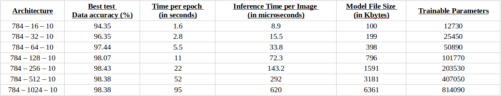

# ANN Framework for the MNIST Dataset

## Software Version : 1.0.0

## Release Date : 2/08/2022

A training framework for training an Artificial Neural Network on the MNIST handwritten digits dataset. Users can configure various parameters such as learning rate, network architecture and activation function.

## Quick setup

The instructions are aimed for a Linux-based environment.

For Ubuntu 20.04, run the following commands to install the g++ compiler and the git package if you haven't installed them.

If you are using a different distribution, change the apt command to suit your distribution's Package Manager.

``` bash
sudo apt install build-essential
sudo apt install git
```
After installing the necessary packages, open a terminal and run the following commands to create a folder in your home directory, clone the repository in that folder, compile with optimization directive -O2 and run the software. 

``` bash
cd
mkdir mnist
cd mnist
git clone https://github.com/Svoronos/ann-mnist
cd ann-mnist
g++ -o mnist_train ./mnist_train.cpp -O2
g++ -o mnist_test ./mnist_test.cpp -O2
./mnist_train
./mnist_test
```


## Introduction

This report will cover the details of this project that implements a Neural Network training framework. The current version of the mlp_training project includes the following features

1. The user can run the application to initialize a multi-layer perceptron of a defined architecture and begin training on a set of data Dtrain and validate the results on a set of test data Dtest.
    - Currently, the architecture of the MLP can be defined by the user. The user can define as many layers as he wants and each layer can contain as many neurons as the user wants.
    - The application is developed to train a MLP-type ANN on the MNIST set of handwritten digits from 0 to 9. 
(see http://yann.lecun.com/exdb/mnist/ )
    - In the MNIST data, the size of the training data is split into
        - 60000 images of handwritten digits that are typically used to train the network
        - 10000 images of handwritten digits that are typically used to test the network’s accuracy
    - After each epoch, the application will compare the test accuracy to the maximum test accuracy that has been observed up to that point. If the current epoch’s accuracy is higher than the max accuracy observed, the model is saved in a binary file format. The binary file can then be parsed in memory for predicting which digit is depicted in a 28 * 28 image. Of course it is necessary to preprocess an image to bring it to a format close to the MNIST dataset (e.g. rescale to 28 * 28, convert to grayscale if its a multi-channel image, separate background/foreground pixels etc.. This preprocessing is not in scope for the current version of the project.)

## User-defined training parameters

The list below includes all the parameters that a user can define when training the network on the MNIST dataset.


## Model file format

### Writing a model from memory to a file format

As mentioned earlier, during the training process, the training application will save a neural network in a binary file format if the network’s accuracy on the test data is the highest at that point. The format that is used to store the model is depicted in the image below.


See function writeModel() in file mlp_lib.hpp for more information.

### Writing a model from memory to a file format

When we store the network in a file format, we can load it using the NeuralNetwork class constructor with a string argument. See     
NeuralNetwork(string modelFileName) 
constructor function in class NeuralNetwork in file mlp_lib.hpp for more information.

## Benchmark results
Below are results from running the training application with a variety of parameters. The measurements were done on an Ubuntu 20.04 LTS desktop running on an Intel Pentium CPU G4600 @ 3.60GHz with an L3 cache of 3 MB and 8 GB of DDR4 RAM @ 2400 MHz.
The current version of the application is developed to run on single-threaded mode. CPU multi-threaded processing or GPU-accelerated training is not yet supported.

Note that your results will differ slightly from the measurements below due to the randomization of the weights.
The table below shows results for various architectures with all other configurable parameters set as

- Learning rate : 0.01
- Epochs : 100
- Activation Function : Sigmoid
- Range of initial weights random values : [-0.05,0.05]




The table below shows results for various multi-layer architectures. To avoid the vanishing gradient effect, a higher range of random initialized weights/biases was used.

- Learning rate : 0.01
- Epochs : 100
- Activation Function : Sigmoid
- Range of initial weights random values : [-0.1,0.1]


# LICENSE

MIT License

Copyright (c) 2022 Svoronos Leivadaros

Permission is hereby granted, free of charge, to any person obtaining a copy
of this software and associated documentation files (the "Software"), to deal
in the Software without restriction, including without limitation the rights
to use, copy, modify, merge, publish, distribute, sublicense, and/or sell
copies of the Software, and to permit persons to whom the Software is
furnished to do so, subject to the following conditions:

The above copyright notice and this permission notice shall be included in all
copies or substantial portions of the Software.

THE SOFTWARE IS PROVIDED "AS IS", WITHOUT WARRANTY OF ANY KIND, EXPRESS OR
IMPLIED, INCLUDING BUT NOT LIMITED TO THE WARRANTIES OF MERCHANTABILITY,
FITNESS FOR A PARTICULAR PURPOSE AND NONINFRINGEMENT. IN NO EVENT SHALL THE
AUTHORS OR COPYRIGHT HOLDERS BE LIABLE FOR ANY CLAIM, DAMAGES OR OTHER
LIABILITY, WHETHER IN AN ACTION OF CONTRACT, TORT OR OTHERWISE, ARISING FROM,
OUT OF OR IN CONNECTION WITH THE SOFTWARE OR THE USE OR OTHER DEALINGS IN THE
SOFTWARE.
